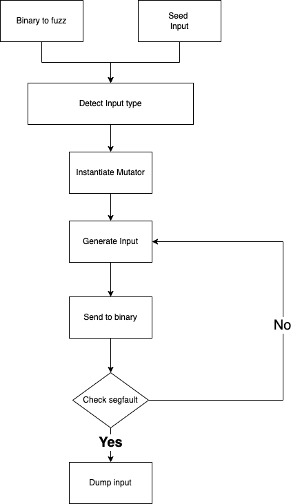

## Fuzzer
### fuzzer flow diagram

Our fuzzer uses a mixture of different mutation methods involving byte manipulation to achieve memory corruption in the given binary.
The mutations methods include:
Bit Flipping
Bit Swapping 
Adding extra rows (CSV Specific)
Inserting multiple bits/bytes
Changing a bit to a random value

We pick these mutations randomly and continue mutating previous inputs until a crash occurs.
We feed the input using python’s subprocess module but the future plan is to use pwntools to interact with the binary to take advantage of pwntool’s in built gdb and core file functionality.

